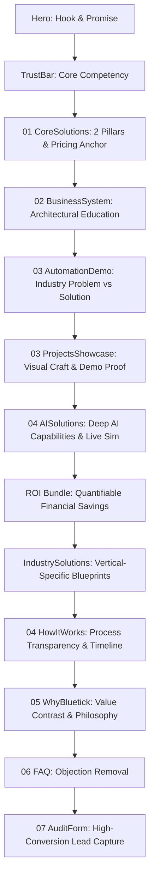
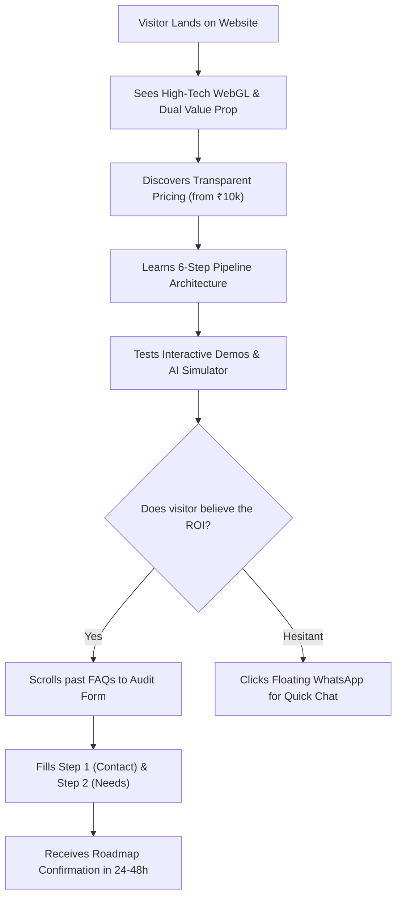
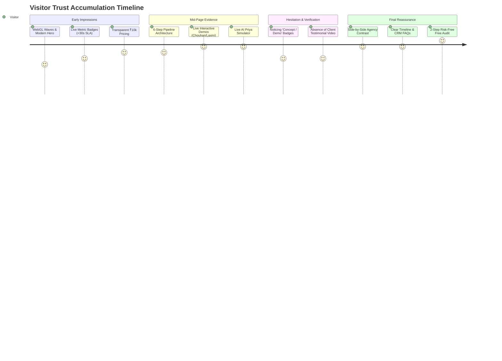

# Bluetick Digital — Content, Narrative & Audience Journey Audit

**Audit Classification:** Strategic Content, CRO, Information Architecture & Audience Psychology Audit  
**Target Entity:** Bluetick Digital (`bluetick-digital-web`)  
**Audit Date:** August 15, 2026  
**Auditor Roles:** Senior Content Strategist, UX Strategist, Conversion Rate Optimization (CRO) Expert, Brand Strategist, Information Architect, Customer Journey Analyst  
**Source Code Baseline:** React 18, Vite, CSS Modules, Supabase Client (`src/components/Home/*`, `src/components/Layout/*`, `src/constants/*`)  

---

## Methodological Definitions

Throughout this audit, every observation and finding is classified into one of three strict methodological categories:
* **[FACT]:** Directly present in the website code, visible copy, markup, tokens, or UI states.
* **[INFERENCE]:** Reasonable, psychologically grounded interpretation of what a first-time target audience member (Indian SME founder, D2C operator, B2B manufacturing director) will understand, feel, or assume.
* **[RECOMMENDATION]:** Strategic architectural, narrative, or copywriting guidance on what should evolve.

---

## 1. Executive Summary

### 1.1 The Core Strategic Finding
**[FACT]:** Bluetick Digital presents itself as an "AI-powered Digital Transformation Partner" providing high-performance websites starting from ₹10,000–₹50,000 and custom AI/WhatsApp workflow automation pipelines.  
**[INFERENCE]:** The current website possesses immense technical depth and sophisticated interactive features (live WebGL shaders, interactive tabs, real-time prompt simulators, dynamic ROI calculation, architectural pipeline diagrams), but suffers from an **Identity Bipolarity & Sequencing Gap**:
1. **The Website vs. AI Agency Dilemma:** A first-time visitor is caught between perceiving Bluetick as an ultra-affordable web design agency (₹10,000 entry point) and an enterprise-grade AI systems integrator. The website frequently swings from selling ₹10,000 landing pages to showing advanced n8n/Supabase LLM pipelines, creating confusion about who the ideal customer is.
2. **Cognitive Overload in the Mid-Funnel:** The homepage contains **13 dense vertical sections**. Sections 01 (`CoreSolutions`), 02 (`BusinessSystem`), 03 (`AutomationDemo`), 04 (`ProjectsShowcase`), 04 (`AISolutions` — duplicate watermark), and `WebsiteAutomationBundle` repeatedly re-explain the concept of "connecting websites with AI and WhatsApp" in 5 different visual formats before providing social proof.
3. **The Proof vs. Demonstration Gap:** While the interactive simulators and conceptual demo systems (`Chouhan Mattress`, `Laxmi Furniture`) are visually high-end, they are labeled `"CONCEPT / DEMO SYSTEM"`. The absence of verified third-party client logos or real client case study testimonials creates a trust bottleneck for high-ticket B2B buyers.

### 1.2 Quantitative Audit Scorecard

| Dimension | Score | Primary Diagnoses |
|---|:---:|---|
| **Content Clarity** | **8.0 / 10** | High clarity in individual explanations; slight ambiguity in service bundling. |
| **Narrative Flow** | **6.5 / 10** | Repetitive middle-funnel capability loops; redundant re-explanations of AI + WhatsApp. |
| **Audience Understanding** | **7.5 / 10** | Clear segmentation by industry, but mixed budget signals (₹10k vs. custom enterprise). |
| **Positioning Clarity** | **7.0 / 10** | Strong "systems engineering" voice, but tension between low-cost web and advanced AI. |
| **Trust Building** | **6.5 / 10** | High architectural transparency; low third-party social proof & customer testimonials. |
| **Proof & Case Studies** | **6.0 / 10** | Strong demo systems, but explicitly labeled "Concept / Demo", limiting hard proof. |
| **CTA Architecture** | **8.0 / 10** | Unified destination (`#audit`), but secondary buttons sometimes compete with primary goals. |
| **Conversion Journey** | **7.0 / 10** | High friction in middle scroll; outstanding 2-step low-friction form at the bottom. |
| **Content Density** | **6.5 / 10** | High to very high density in sections 02, 04, and ROI bundle. |
| **Audience Direction** | **7.0 / 10** | Clear progression from Hero to Audit, but easily sidetracked by multiple interactive toys. |
| **OVERALL NARRATIVE SCORE** | **7.0 / 10** | **Strong Foundation with High CRO & Narrative Upside.** |

---

## 2. Complete Website Content Inventory

This inventory documents all 13 visible homepage sections, layout headers, footers, and interactive elements.

```
[Header Navigation] -> [Hero + HeroVisual] -> [TrustBar] -> [01 / CoreSolutions] -> [02 / BusinessSystem] -> [03 / AutomationDemo] -> [03 / ProjectsShowcase] -> [04 / AISolutions] -> [WebsiteAutomationBundle] -> [IndustrySolutions] -> [04 / HowItWorks] -> [05 / WhyBluetick] -> [06 / FAQ] -> [07 / AuditForm] -> [Footer]
```

### Detailed Section-by-Section Inventory Table

| Order | Section Name | Headline & Subtitle | Key Content Elements & Copy | CTAs & Destinations | Interactive Elements |
|:---:|---|---|---|---|---|
| **00** | **Header & Navigation** | *Logo:* `BluetickDigital`<br>*Tagline:* Systems & AI Architecture | • Solutions Dropdown (`Websites`, `E-commerce`, `AI Automation`, `WhatsApp Automation`)<br>• Industries Dropdown (`E-commerce`, `Manufacturers`, `Startups`, `Local Businesses`)<br>• Links: `How It Works`, `Projects`, `About` | Primary CTA: `"Get Free Audit"` (`#audit`) | • Dropdown hover menus<br>• Mobile hamburger drawer with backdrop blur<br>• Scroll-triggered glassmorphism header |
| **01** | **Hero Section** | **Headline:** "Websites + AI that turn your digital presence into a growth engine."<br>**Subtitle:** "We engineer high-performance business web architecture and connect custom AI automation pipelines to eliminate manual lead handling and scale operations." | • Kicker Badge: "Next-Gen Digital Infrastructure" (Live pulsing green dot)<br>• 3 Capability Pills: High-converting business & e-commerce websites; Custom AI agents for 24/7 qualification; Seamless CRM & WhatsApp sync<br>• 3 Live Metric Pills: `<30s Lead Response`, `+184% Lead Conversion`, `100% Automated CRM Sync` | • Primary: `"Get Your Free Audit"` (`#audit`)<br>• Secondary: `"Explore Solutions"` (`#solutions`) | • WebGL `GradientWaves` canvas<br>• `ScrollExpand` zoom-in stage<br>• `HeroVisual` 3-tab architecture visualizer (`System Architecture`, `Lead Flow`, `Automation Pipeline`) with interactive simulation trigger |
| **02** | **TrustBar** | **Header:** "Engineering High-Performance Digital Infrastructure for E-commerce Brands, Manufacturers & Startups." | • 4 Capability Pills: `Modern Web Architecture`, `AI Intent Qualification`, `n8n Workflow Automation`, `Supabase & CRM Sync` | None (Informational Bar) | • Scroll-triggered opacity and translateY reveals |
| **03** | **CoreSolutions** (`01` Watermark) | **Headline:** "Two pillars. One connected business engine."<br>**Subtitle:** "Whether you need a high-converting web platform, automated business workflows, or a unified ecosystem — we engineer custom solutions built around your exact growth pipeline." | • Mode Selector Tabs: `Connected Full Engine`, `Digital Web Platform`, `AI Workflow Automation`<br>• **Pillar 01 (Websites):** Business Websites (from ₹10,000), Premium Profile Websites (from ₹20,000), Small E-commerce (from ₹30,000), Large Catalog Platforms (from ₹50,000)<br>• **Pillar 02 (AI Automation):** AI WhatsApp Agents, Lead Intelligence & Scoring, Business Workflow Integrations, "Custom pricing scoped to your workflow"<br>• Mandatory Scoping Disclaimer Box | • Pillar 01 CTA: `"Explore Web Solutions"` (`#audit`)<br>• Pillar 02 CTA: `"Explore AI Automation"` (`#audit`) | • Interactive 3-mode selector tabs with layout gliders<br>• Radial spotlight hover glow on Pillar 02 card<br>• Pricing item micro-slide hover effects |
| **04** | **BusinessSystem** (`02` Watermark) | **Headline:** "Don't just build a website. Build a business system."<br>**Subtitle:** "Your website should not work in isolation. We connect your digital presence with AI and automation to eliminate manual follow-up and streamline your sales operations." | • Section Badge: "Connected Ecosystem"<br>• 6-Step Horizontal Pipeline:<br>  - 01: *Traffic & Visitor Arrival* (Core Web Vitals specs)<br>  - 02: *Smart Capture* (Web forms, WhatsApp CTA)<br>  - 03: *AI Qualification* (Custom LLM prompt scoring)<br>  - 04: *CRM & DB Sync* (Supabase/Zoho/HubSpot real-time sync)<br>  - 05: *Automated Follow-Up* (7-14 day multi-touch nurturing)<br>  - 06: *Sale & Conversion* (Automated calendar slot booking) | None (Educational Architecture) | • Step hover activation revealing technical detail badges and highlighted borders |
| **05** | **AutomationDemo** (`03 /` Label) | **Headline:** "Real business challenges. Automated solutions."<br>**Subtitle:** "Select an industry below to see how Bluetick builds tailored automation systems to solve real operational bottlenecks." | • 4 Industry Tabs: `E-commerce Brands`, `Manufacturers & B2B`, `Startups & Tech`, `Real Estate & Local Services`<br>• 3-Column Narrative Card per Tab:<br>  - Col 1 (*The Problem*): Specific operational bottleneck<br>  - Col 2 (*What Bluetick Builds*): Connected automation system<br>  - Col 3 (*Business Outcome*): Quantifiable metrics (`+184% Lead Conversion`, `-75% Manual Work`, `<30s Response Speed`, `100% Lead Capture`) | Secondary CTA: `"Request Custom Scoped Architecture"` (`#audit`) | • Interactive tab selector with Framer Motion layout transition<br>• Dynamic 3-column story animation on tab change |
| **06** | **ProjectsShowcase** (`03` Watermark) | **Headline:** "SELECTED DIGITAL SYSTEMS"<br>**Subtitle:** "Websites and digital experiences engineered around real business models." | • Section Badge: "Systems Portfolio"<br>• **Project 01:** *Chouhan Mattress* (D2C E-commerce, High-performance mattress & home-comfort UX, 4 capabilities, `"CONCEPT / DEMO SYSTEM"` badge)<br>• **Project 02:** *Laxmi Furniture* (Furniture Commerce / Local Retail, WhatsApp lead capture & showroom discovery, 4 capabilities, `"CONCEPT / DEMO SYSTEM"` badge)<br>• Full browser preview window mockups | Secondary CTAs: `"Explore Live Demo"` (External links to Vercel demo URLs) | • Live demo links opening in new tabs<br>• Hover tilt and elevation on project browser preview cards |
| **07** | **AISolutions** (`04` Watermark) | **Headline:** "Core AI & Automation Solutions."<br>**Subtitle:** "Practical business systems designed to solve operational bottlenecks, save time, and boost revenue." | • Section Badge: "Intelligence Suite"<br>• **Hero Live AI Simulator:** Interactive prompt tabs (`Price Inquiry`, `Demo Slot`, `Custom API`) showing real-time chat dialogue between "Prospect" and "AI Priya Agent", calculated intent tags (`HOT LEAD`, `DEMO BOOKED`, `TECHNICAL INQUIRY`), and `<18s SLA` CRM dispatch status<br>• **6 Bento Grid Solution Cards:** AI WhatsApp Agent, Lead Qualification Engine, AI Customer Support, Automated Nurturing, AI Demo Scheduler, Workflow Infrastructure | None inside grid; Simulator drives conceptual buy-in | • Interactive simulation prompt buttons<br>• Interactive "Flip to Solution / Problem" toggle on every bento card<br>• 3D tilt and mouse spotlight glow on cards |
| **08** | **WebsiteAutomationBundle** | **Headline:** "Quantifiable Business Growth."<br>**Subtitle:** "We don't just build websites — we build automated business engines that eliminate manual overhead and generate measurable ROI." | • Section Badge: "System Savings & ROI Engine"<br>• 4-Node Convergence Diagram: `High-Speed Website` + `AI Intent Agent` + `WhatsApp API` + `Supabase CRM Sync`<br>• **Notched ROI Card:** "With Bluetick Systems your business saves ₹ 5,90,000+ (Est. Annual Savings: 34%)"<br>• Savings breakdown table: Labor (₹2.55L), Lead Drop-off (₹1.93L), Support (₹1.42L)<br>• Embedded Mini Lead Capture: "Want to know your exact ROI?" | Direct Form Submit: `"RUN ROI AUDIT"` (In-place submission) | • WebGL Strands animated background<br>• Inline mini form with instant success state feedback |
| **09** | **IndustrySolutions** | **Headline:** "Solutions built for your specific industry."<br>**Subtitle:** "We don't build generic websites. We design industry-specific digital engines tailored to your customer journey." | • Section Badge: "Industry Expertise"<br>• 4 Detailed Sector Cards: `E-commerce Brands`, `Manufacturers`, `Startups & Tech`, `Local Businesses & Real Estate`<br>• 4 bulleted bulletproof use cases per industry card (COD confirmation, RFQ capture, calendar sync, site visit booking) | None (Drives scroll down to How It Works) | • Hover elevation cards with staggered viewport scroll entrance |
| **10** | **HowItWorks** (`04` Watermark) | **Headline:** "Process & Execution"<br>**Subtitle:** "From initial workflow audit to live system deployment, we build end-to-end digital infrastructure that turns leads into measurable business outcomes." | • 4-Phase Chronological Timeline:<br>  - Phase 01: *Understand* (Discovery & Audit)<br>  - Phase 02: *Design* (Architecture)<br>  - Phase 03: *Build & Integrate* (Engineering)<br>  - Phase 04: *Launch & Scale* (Scale & Growth) | None | • Animated SVG timeline connector path drawing on viewport entry |
| **11** | **WhyBluetick** (`05` Watermark) | **Headline:** "Technology should simplify your business, not add complexity."<br>**Subtitle:** "Why growing businesses choose Bluetick Digital as their digital transformation partner." | • Section Badge: "Systems Engineering Philosophy"<br>• **High-Impact Quote Block:** "We have not seen this level of response speed and qualification accuracy before..." — *Vikram Chouhan, Co-Founder & Technical Architect*<br>• **Side-by-Side Comparison Matrix:**<br>  - Legacy Approach (Traditional Agency): Disconnected tools, hours/days response, fragmented spreadsheets, one-off static delivery<br>  - Bluetick Engineering (Systemized Partner): Unified connected ecosystem, <30s response, automated n8n pipelines, long-term engineering partner | None | • Side-by-side contrast grid with staggered card animations |
| **12** | **FAQ Section** (`06` Watermark) | **Headline:** "Frequently Asked Questions."<br>**Subtitle:** "Everything you need to know about our website development, AI automation solutions, pricing, and onboarding process." | • Section Badge: "Clear Answers"<br>• 7 Interactive Accordion Questions:<br>  1. What does Bluetick Digital do?<br>  2. How long does a project take? (7-10 days web, 14-21 days automation)<br>  3. How does AI Automation work with my existing website?<br>  4. How is pricing structured? (₹10k web, ₹30k-50k ecom, ₹5k+₹1k/mo automation)<br>  5. What software tools & CRMs can you integrate?<br>  6. Do I need a new WhatsApp number?<br>  7. What support & maintenance do you provide? | None | • Single-expand smooth accordion transitions with chevron rotation |
| **13** | **AuditForm** (`07` Watermark) | **Headline:** "Get Your Free Website & Automation Audit."<br>**Subtitle:** "Tell us about your business goals and current setup. We’ll analyze your website, identify automation opportunities, and send you an actionable roadmap." | • Section Badge: "Free Growth Assessment"<br>• **Left Benefit Specs:** UX & Speed Analysis, AI Automation Mapping, WhatsApp Workflow Design, 24-48h Delivery Turnaround<br>• **Right 2-Step Form:**<br>  - Step 1: Full Name, Business Name, WhatsApp Number, Website URL<br>  - Step 2: Business Type, Primary Requirement, Monthly Leads Volume, Biggest Challenge | Primary Conversion Submit: `"Next: Business Details"` -> `"Generate My Growth Roadmap"` | • 2-Step progressive intake state machine<br>• Direct atomic Supabase `leads` table insertion with loading spinner & success confirmation card |
| **14** | **Footer & Floating Widgets** | **Brand Info:** "AI-powered Digital Transformation Partner for growing businesses."<br>**HQ:** Raipur, Chhattisgarh, India | • Columns: Solutions, Industries, Company<br>• Enterprise Security Badge ("256-bit SSL Encrypted & RLS Enforced")<br>• Direct WhatsApp Link (`+91 6261003050`)<br>• Floating WhatsApp CTA Button & BackToTop Button | Direct Links to `/solutions/*`, `/industries/*`, `/about`, `/blog`, WhatsApp | • Floating spring-animated WhatsApp button with pulse indicator |

---

## 3. Section-by-Section Purpose & Narrative Function Map



### Detailed Section Purpose Analysis

#### 1. Hero (`Hero.jsx` + `HeroVisual.jsx`)
* **Purpose:** Immediately capture attention, declare the core dual-offering (Websites + AI), and establish an engineering-grade tone.
* **Primary Message:** Websites and AI automation combined turn business web presence into a measurable growth engine.
* **Secondary Message:** Bluetick responds in `<30s`, boosts conversion by `+184%`, and eliminates manual CRM tasks.
* **Question It Answers:** *"What is Bluetick Digital, and why should I care?"*
* **Audience Assumption:** "This is an advanced tech studio that builds websites that don't just sit there, but actively capture and qualify leads."
* **Trust Function:** High visual polish, live WebGL background, and interactive telemetry diagrams immediately signal technical competence.
* **Conversion Function:** Dual CTAs give immediate high-intent conversion (`Get Free Audit`) and low-intent discovery (`Explore Solutions`).
* **Next Intended Action:** Scroll down to see the proof and breakdown.

#### 2. TrustBar (`TrustBar.jsx`)
* **Purpose:** Establish the 4 foundational pillars of technical execution.
* **Primary Message:** We engineer websites, AI, n8n workflows, and Supabase database integrations.
* **Secondary Message:** We focus on E-commerce brands, Manufacturers, and Startups.
* **Question It Answers:** *"What specific technologies and domains do they operate in?"*
* **Audience Assumption:** "They use modern backend tools (n8n, Supabase), not just standard WordPress templates."
* **Trust Function:** Explicit technical language filters out unqualified low-tech buyers and builds credibility with serious founders.
* **Conversion Function:** Passive reinforcement.
* **Next Intended Action:** Move directly into the service catalog.

#### 3. CoreSolutions (`CoreSolutions.jsx` — `01` Watermark)
* **Purpose:** Break the offering into two digestible pillars (Websites vs AI Automation) and anchor pricing transparency.
* **Primary Message:** You can buy a standalone website (starting at ₹10,000), custom AI automation, or a unified full engine.
* **Secondary Message:** Final pricing is scoped to feature depth; AI automation is custom-quoted.
* **Question It Answers:** *"What exactly can I buy from Bluetick, and what is the starting budget?"*
* **Audience Assumption:** "They are very affordable for basic websites (₹10k–₹50k), but AI automation requires a custom scope discussion."
* **Trust Function:** Upfront price numbers eliminate fear of hidden costs; disclaimer manages enterprise expectations.
* **Conversion Function:** Dual card CTAs push the visitor directly to the audit form.
* **Next Intended Action:** Understand how these two pillars connect in practice.

#### 4. BusinessSystem (`BusinessSystem.jsx` — `02` Watermark)
* **Purpose:** Educate the visitor on why a standalone website is obsolete and why an integrated pipeline is necessary.
* **Primary Message:** A website must be connected to smart capture, AI qualification, CRM sync, and automated follow-ups.
* **Secondary Message:** Bluetick builds the entire 6-step pipeline from visitor arrival to closed sale.
* **Question It Answers:** *"Why do I need AI and automation if I already have a website?"*
* **Audience Assumption:** "My current website is leaking leads because we don't have instant AI qualification and automated follow-up."
* **Trust Function:** Demonstrates systematic architectural thinking rather than superficial graphic design.
* **Conversion Function:** Agitates the problem of manual sales follow-up and CRM entry.
* **Next Intended Action:** See how this works in my specific industry.

#### 5. AutomationDemo (`AutomationDemo.jsx` — `03 /` Label)
* **Purpose:** Translate abstract architecture into concrete, industry-specific Problem → Solution → Outcome stories.
* **Primary Message:** In E-commerce, Manufacturing, Startups, and Local Business, Bluetick solves exact operational bottlenecks.
* **Secondary Message:** Measurable outcomes include `-75% manual work` and `<30s response speeds`.
* **Question It Answers:** *"How does this apply to my exact business model?"*
* **Audience Assumption:** "They understand my daily headaches (e.g., unqualified RFQs in manufacturing, COD verification in e-commerce)."
* **Trust Function:** Specific industry operational literacy proves domain expertise.
* **Conversion Function:** Dedicated tab CTA: `"Request Custom Scoped Architecture"`.
* **Next Intended Action:** Look for real-world projects that Bluetick has designed.

#### 6. ProjectsShowcase (`ProjectsShowcase.jsx` — `03` Watermark)
* **Purpose:** Provide tangible visual proof of frontend design and UX engineering capability.
* **Primary Message:** We build high-speed, conversion-focused D2C and local retail commerce platforms.
* **Secondary Message:** Demonstrates Chouhan Mattress and Laxmi Furniture with full live preview links.
* **Question It Answers:** *"What do their actual websites look and feel like?"*
* **Audience Assumption:** "Their design quality is clean, modern, and mobile-responsive."
* **Trust Function:** Live external Vercel URLs allow the visitor to test real web performance and UX directly.
* **Conversion Function:** Reassures the visitor that Bluetick can deliver aesthetic and functional excellence.
* **Next Intended Action:** Investigate the AI capabilities under the hood.

#### 7. AISolutions (`AISolutions.jsx` — `04` Watermark)
* **Purpose:** Deep-dive into specific AI modules and provide a hands-on live simulation of AI Priya.
* **Primary Message:** AI can handle WhatsApp lead response, intent scoring, support tickets, nurturing, and demo booking automatically.
* **Secondary Message:** AI Priya can classify hot buy intent in `<18s SLA` with 98% accuracy.
* **Question It Answers:** *"What specific AI features will I get, and how smart is the bot really?"*
* **Audience Assumption:** "This is not a dumb rule-based chatbot; it understands natural Hindi/English and dynamically calculates intent."
* **Trust Function:** Interactive simulator lets the user test prompts live on the screen without leaving the page.
* **Conversion Function:** Proves technical superiority over traditional chat widgets.
* **Next Intended Action:** Calculate the financial return on investment.

#### 8. WebsiteAutomationBundle & NotchedRoiCard (`WebsiteAutomationBundle.jsx`)
* **Purpose:** Financially justify the investment by displaying calculated annual savings and providing an inline ROI audit tool.
* **Primary Message:** An automated system saves an average Indian business ₹ 5,90,000+ per year in labor, dropped leads, and support.
* **Secondary Message:** You can enter your email/WhatsApp right here to receive a custom ROI analysis.
* **Question It Answers:** *"What is the financial return on investment for my business?"*
* **Audience Assumption:** "This system pays for itself by preventing dropped leads and saving team salaries."
* **Trust Function:** Itemized breakdown of savings (Labor: ₹2.55L, Recovery: ₹1.93L, Support: ₹1.42L) adds concrete financial realism.
* **Conversion Function:** High-speed inline lead capture (`RUN ROI AUDIT`) captures contact info mid-page.
* **Next Intended Action:** Review industry use cases or implementation process.

#### 9. IndustrySolutions (`IndustrySolutions.jsx`)
* **Purpose:** Re-affirm vertical competence across 4 core market segments.
* **Primary Message:** Every industry receives a dedicated architecture tailored to its buyer journey.
* **Secondary Message:** Covers E-commerce, Manufacturers, Startups, and Local Businesses with 4 detailed use cases each.
* **Question It Answers:** *"Are they specialized in my industry or just generalists?"*
* **Audience Assumption:** "They have ready-made blueprints for my sector."
* **Trust Function:** Reinforces earlier messages with structured checklists.
* **Conversion Function:** Narrows the scope to relevant business needs.
* **Next Intended Action:** Understand how Bluetick executes the project from start to finish.

#### 10. HowItWorks (`HowItWorks.jsx` — `04` Watermark)
* **Purpose:** De-risk the project by establishing a transparent 4-phase delivery methodology.
* **Primary Message:** We follow a disciplined 4-stage pipeline: Understand (Audit) → Design (Architecture) → Build (Engineering) → Launch (Scale).
* **Secondary Message:** The process is structured, collaborative, and fast.
* **Question It Answers:** *"How do we work together, and what are the steps after I say yes?"*
* **Audience Assumption:** "I won't be left with broken software; they handle everything from audit to post-launch scaling."
* **Trust Function:** Clear project phases eliminate fear of chaotic freelancer delivery.
* **Conversion Function:** Positions the "Audit" as Phase 01, making the final form feel like the natural first step.
* **Next Intended Action:** Evaluate company philosophy and compare with traditional agencies.

#### 11. WhyBluetick (`WhyBluetick.jsx` — `05` Watermark)
* **Purpose:** Position Bluetick as an engineering partner and contrast directly against traditional marketing agencies.
* **Primary Message:** Traditional agencies give you disconnected tools and slow responses; Bluetick builds unified, scalable systems with `<30s` SLAs.
* **Secondary Message:** "Technology should simplify your business, not add complexity."
* **Question It Answers:** *"Why shouldn't I just hire a traditional web design agency or freelancer?"*
* **Audience Assumption:** "Traditional agencies will just give me a pretty WordPress site and leave me to manually handle leads. Bluetick builds a full operational system."
* **Trust Function:** Side-by-side comparison table highlights real operational pain points (spreadsheets, missed chats, slow response).
* **Conversion Function:** Creates urgency to escape the inefficiencies of traditional agency models.
* **Next Intended Action:** Resolve final lingering doubts before converting.

#### 12. FAQ Section (`FAQ.jsx` — `06` Watermark)
* **Purpose:** Eliminate all standard transactional, technical, timeline, and pricing objections.
* **Primary Message:** Projects take 7–21 days; pricing is clear (₹10k+ web, ₹5k setup automation); we integrate all major CRMs and handle WhatsApp API verification.
* **Secondary Message:** Bluetick provides continuous maintenance and post-launch monitoring.
* **Question It Answers:** *"How much time does it take? Do I need a new phone number? What CRMs work?"*
* **Audience Assumption:** "All my logistical questions have straightforward answers; there are no hidden surprises."
* **Trust Function:** Direct, no-fluff answers to technical and operational concerns.
* **Conversion Function:** Removes the final friction before the visitor reaches the audit form.
* **Next Intended Action:** Fill out the free audit form.

#### 13. AuditForm (`AuditForm.jsx` — `07` Watermark)
* **Purpose:** Capture qualified prospect information with minimal friction using a 2-step progressive intake form.
* **Primary Message:** Request a 100% free Website & Automation Audit and receive an actionable growth roadmap in 24–48 hours.
* **Secondary Message:** Includes UX speed analysis, AI automation mapping, and WhatsApp workflow design.
* **Question It Answers:** *"What do I do now, and what will I get immediately after submitting?"*
* **Audience Assumption:** "I am getting a valuable, custom-scoped roadmap for free with zero risk."
* **Trust Function:** Clear 2-step progress indicator, security badges, and explicit delivery SLA (24–48h).
* **Conversion Function:** Primary business conversion point storing leads atomically in Supabase.
* **Next Intended Action:** Submit lead data and await WhatsApp roadmap delivery.

---

## 4. Audience Questions & Answers Map

```
AUDIENCE QUESTION ───────────────► WHERE ANSWERED ───────────────► CLARITY RATING
"What is Bluetick?"               Hero & Header                   ⭐⭐⭐⭐⭐ (Instant)
"What does it cost?"              CoreSolutions & FAQ             ⭐⭐⭐⭐   (Good for web, custom for AI)
"Can I see examples?"             ProjectsShowcase                ⭐⭐⭐     (Good demos, but marked 'Concept')
"Can I trust them?"               WhyBluetick & Tech Specs        ⭐⭐⭐     (High tech trust, low social proof)
"What happens after I inquire?"   HowItWorks & AuditForm          ⭐⭐⭐⭐⭐ (Very Clear: 24-48h Roadmap)
```

### Detailed Question-to-Answer Matrix

| # | Visitor's Natural Question | Where Is It Answered? | How Clearly Is It Answered? | Timing Evaluation | Status |
|:---:|---|---|---|---|:---:|
| **1** | **What is Bluetick?** | Hero Headline & Subtitle | Very Clear ("Websites + AI that turn your digital presence into a growth engine") | Immediate (0–5s) | ✅ Answered |
| **2** | **What exactly do they offer?** | CoreSolutions (`01`), AISolutions (`04`) | Very Clear (Two pillars: Websites & AI Automation) | Early (10–20s) | ✅ Answered |
| **3** | **Is this a website agency?** | CoreSolutions Pillar 01 | Clear (Builds business sites from ₹10k, e-com from ₹30k) | Early (15s) | ✅ Answered |
| **4** | **Is this an AI automation company?** | CoreSolutions Pillar 02, AISolutions | Very Clear (n8n, LLM qualification, WhatsApp API) | Early & Mid | ✅ Answered |
| **5** | **Do they build custom systems?** | CoreSolutions, HowItWorks | Clear (Custom-scoped workflows and CRM integrations) | Mid (30s) | ✅ Answered |
| **6** | **Who are their target customers?** | TrustBar, AutomationDemo, IndustrySolutions | Very Clear (E-commerce, Manufacturers, Startups, Local Businesses) | Consistent throughout | ✅ Answered |
| **7** | **Can they solve my specific business problem?** | AutomationDemo (`03`), IndustrySolutions | Extremely Clear (Tabbed Problem → Solution → Outcome breakdown) | Mid (25–45s) | ✅ Answered |
| **8** | **What does it cost?** | CoreSolutions, NotchedRoiCard, FAQ | Clear for Websites (₹10k–₹50k); Ambiguous for AI ("Custom Scoped" in Pillar 02 vs "₹5k + ₹1k/mo" in FAQ) | Split across page | ⚠️ Slight Conflict |
| **9** | **Can I see real client examples?** | ProjectsShowcase (`03`) | Partially Clear (Chouhan Mattress & Laxmi Furniture have live links, but carry `"CONCEPT / DEMO SYSTEM"` badges) | Mid (35s) | ⚠️ Lacks Live Client Logos |
| **10** | **Can I trust them?** | WhyBluetick, Tech Specs, Quote | Moderate (High technical credibility, but quote is from internal co-founder, no external client reviews) | Late (50s) | ⚠️ Missing Third-Party Reviews |
| **11** | **How does their process work?** | HowItWorks (`04`) | Very Clear (4-phase Understand → Design → Build → Scale timeline) | Mid-Late (45s) | ✅ Answered |
| **12** | **What happens after I contact them?** | HowItWorks Phase 01, AuditForm copy | Very Clear (Receive a free custom growth roadmap in 24–48 hours via WhatsApp) | Late (60s) | ✅ Answered |
| **13** | **Why choose Bluetick over others?** | WhyBluetick Comparison Grid | Very Clear (Connected systems & <30s SLAs vs. fragmented agency spreadsheets) | Late (55s) | ✅ Answered |
| **14** | **What should I do right now?** | AuditForm, Hero CTA, Floating WhatsApp | Extremely Clear (`Get Free Audit` / `RUN ROI AUDIT` / WhatsApp chat) | Throughout page | ✅ Answered |

---

## 5. Current Narrative Architecture

### 5.1 The Actual Current Narrative Flow

```
[ATTENTION & HOOK] (Hero + HeroVisual)
       ↓
[CAPABILITY ANCHOR] (TrustBar)
       ↓
[SERVICE & PRICE INTRO] (01 CoreSolutions)
       ↓
[ARCHITECTURAL EDUCATION] (02 BusinessSystem)
       ↓
[INDUSTRY PROBLEM AGITATION] (03 AutomationDemo)
       ↓
[DEMO CRAFT PROOF] (03 ProjectsShowcase)
       ↓
[AI CAPABILITY & SIMULATION] (04 AISolutions)
       ↓
[FINANCIAL ROI JUSTIFICATION] (WebsiteAutomationBundle)
       ↓
[VERTICAL RE-ASSERTION] (IndustrySolutions)
       ↓
[PROCESS TRANSPARENCY] (04 HowItWorks)
       ↓
[VALUE PROPOSITION CONTRAST] (05 WhyBluetick)
       ↓
[OBJECTION ELIMINATION] (06 FAQ)
       ↓
[ACTION & CONVERSION] (07 AuditForm)
```

### 5.2 Narrative Formula Description
**[INFERENCE]:** The website does not strictly follow standard linear AIDA (Attention, Interest, Desire, Action) or PAS (Problem, Agitate, Solve). Instead, it follows an **Engineering-First Technical Showcase Model**:
> **"Currently the website takes the visitor from Technical Hook → Service Menu & Pricing → Pipeline Education → Industry Problem/Solution → Demo Previews → AI Deep-Dive Simulator → Financial Savings Math → Vertical Blueprints → Process Steps → Agency Comparison → FAQs → Free Audit Form."**

### 5.3 Narrative Strengths & Weaknesses
* **Strength:** Exceptional educational depth. A founder who reads the full page will completely understand *why* modern web architecture must connect to WhatsApp and AI.
* **Weakness:** The narrative repeats the "Connected Website + AI + WhatsApp" concept five separate times across sections 01, 02, 03, 04, and the ROI bundle, creating narrative fatigue before the visitor reaches the WhyBluetick comparison.

---

## 6. Audience Perception Timeline (0 to 60+ Seconds)

```
0s ─────────── 5s ─────────── 15s ─────────── 30s ─────────── 60s ─────────── 60s+
[Visual Hook]   [Dual Pillar]  [Pipeline      [Interactive   [Financial     [Conversion:
& Futuristic    & Transparent  Education      Simulations &  Validation &   2-Step Free
Tech Vibe]      Pricing]       & Bottlenecks] Demo Proof]    Comparison]    Audit Form]
```

### 6.1 Second 0–5 (The First Glance)
* **What I See:** High-contrast dark hero stage expanding over dynamic blue WebGL waves, bold typography (`Websites + AI that turn your digital presence into a growth engine`), and an interactive architectural diagram (`HeroVisual`) with glowing nodes.
* **What I Understand:** Bluetick builds modern business websites connected to AI systems.
* **What I Do NOT Understand:** Whether this is an agency, a SaaS product, or a software consultancy.
* **What I Assume:** "This looks like a Silicon Valley or high-end European tech studio. They probably build expensive systems."
* **Emotion Created:** High curiosity, visual intrigue, professional credibility.

### 6.2 Second 5–15 (The Scroll Begins)
* **What Additional Info I Receive:**
  - TrustBar displays 4 pillars: `Modern Web Architecture`, `AI Intent Qualification`, `n8n Workflows`, `Supabase`.
  - CoreSolutions shows clear pricing: Business websites starting at ₹10,000; E-commerce starting at ₹30,000; AI automation custom scoped.
* **What Problem Bluetick Solves:** Eliminates slow response times and disconnected website leads.
* **Who They Serve:** Indian businesses, manufacturers, e-commerce stores, startups.
* **Do I Trust Them More?:** Yes, because they publicly display entry prices (₹10,000) rather than hiding behind a "Contact Sales" wall.

### 6.3 Second 15–30 (The Education Phase)
* **What the Website Teaches Me:**
  - `02 BusinessSystem` explains the 6-step flow (Visitor → Smart Capture → AI Qualification → CRM Sync → Nurturing → Closed Sale).
  - `03 AutomationDemo` breaks down specific bottlenecks (e.g., unqualified RFQs in manufacturing, manual COD calls in e-commerce).
* **What Differentiates Bluetick:** They don't just design graphic layouts; they engineer the backend automation plumbing that routes leads into CRMs.

### 6.4 Second 30–60 (Proof & Deep Dive)
* **What Proof I Encounter:**
  - `03 ProjectsShowcase`: Live interactive previews of Chouhan Mattress and Laxmi Furniture.
  - `04 AISolutions`: Live interactive chat simulator showing AI Priya scoring lead intent in real time.
  - `WebsiteAutomationBundle`: An itemized ROI calculator claiming ₹5,90,000+ annual savings.
* **Objections Addressed:** "Will the AI sound robotic?" (Addressed by simulator); "Is it worth the money?" (Addressed by ROI card).
* **Lingering Hesitation:** "Are Chouhan Mattress and Laxmi Furniture paying clients or internal concept demos?" (Badges say "Concept / Demo System").

### 6.5 Second 60+ (The Decision to Act)
* **What Action I Am Pushed Toward:** Filling out the 2-step Free Website & Automation Audit form.
* **Strongest CTA:** `"Get Your Free Website & Automation Audit"` — promise of a custom growth roadmap delivered in 24–48 hours via WhatsApp.
* **Alternative Actions Available:** Floating WhatsApp button for immediate chat; inline `"RUN ROI AUDIT"` mini-form.

---

## 7. Audience Direction Map



**[INFERENCE]:** The overall audience direction is **largely intentional and structured**, guiding the visitor from macro capability to micro proof, financial justification, objection removal, and final low-friction conversion.  
**Friction Point:** The middle section (between `ProjectsShowcase` and `WebsiteAutomationBundle`) is dense with multiple interactive widgets, which can cause visitors on mobile devices to get stuck in interactive loops rather than progressing smoothly toward the final audit form.

---

## 8. CTA Architecture & Hierarchy Map

```
PRIMARY TIER:      [Get Your Free Audit] (Hero, Header, AuditForm) ────► 100% Focused on #audit
SECONDARY TIER:    [Explore Solutions / Live Demos]               ────► Self-Guided Exploration
TERTIARY TIER:     [Floating WhatsApp Button]                     ────► Direct Instant Communication
```

### Complete CTA Inventory Table

| CTA Label | Section Location | Exact Wording | Hierarchy Tier | Destination | Business Purpose |
|---|---|---|:---:|---|---|
| **Header CTA** | Header (Navbar) | `"Get Free Audit"` | **Primary** | `#audit` | Direct navigation to bottom conversion form |
| **Hero Primary CTA** | Hero Section | `"Get Your Free Audit"` + Arrow | **Primary** | `#audit` | High-intent hero conversion |
| **Hero Secondary CTA** | Hero Section | `"Explore Solutions"` | Secondary | `#solutions` | Low-intent smooth scroll down |
| **Pillar 01 CTA** | CoreSolutions | `"Explore Web Solutions"` + Arrow | Secondary | `#audit` | Directs web-interested leads to audit form |
| **Pillar 02 CTA** | CoreSolutions | `"Explore AI Automation"` + Arrow | Secondary | `#audit` | Directs automation-interested leads to audit form |
| **Industry Demo CTA** | AutomationDemo | `"Request Custom Scoped Architecture"` | Secondary | `#audit` | Bridges industry use case to audit intake |
| **Chouhan Mattress CTA**| ProjectsShowcase | `"Explore Live Demo"` + Arrow | Secondary | External Demo URL | Visual craft verification |
| **Laxmi Furniture CTA** | ProjectsShowcase | `"Explore Live Demo"` + Arrow | Secondary | External Demo URL | Visual craft verification |
| **ROI Form Submit** | WebsiteAutomationBundle | `"RUN ROI AUDIT"` + Arrow | **Primary** (Inline) | In-place submit | Captures immediate email/WhatsApp |
| **Audit Form Step 1** | AuditForm | `"Next: Business Details"` + Arrow | **Primary** | State Machine Step 2 | Progression to requirements capture |
| **Audit Form Final** | AuditForm | `"Generate My Growth Roadmap"` + Sparkles | **Primary** | Supabase `leads` Table | Lead generation conversion |
| **Floating Action Button**| Global Viewport | WhatsApp Icon + Pulse | **Tertiary** | `https://wa.me/916261003050` | Zero-friction instant chat |

### CTA Analysis Summary
* **Are there too many CTAs?:** No. Almost all internal CTAs systematically resolve to `#audit`, ensuring a single conversion destination.
* **Are CTA labels consistent?:** Yes, consistent focus on "Audit", "Roadmap", and "Explore".
* **Do CTAs match visitor awareness?:** Yes. Early CTAs invite "Free Audit"; middle CTAs offer "Scoped Architecture"; final CTA promises a "Growth Roadmap".

---

## 9. Conversion Funnel Analysis

```
STAGE 1: TRAFFIC & LANDING      ──► Hero, WebGL Ambient Background
STAGE 2: UNDERSTANDING          ──► TrustBar, 01 CoreSolutions
STAGE 3: INTEREST & DESIRE      ──► 02 BusinessSystem, 03 AutomationDemo
STAGE 4: PROOF & CAPABILITY     ──► 03 ProjectsShowcase, 04 AISolutions
STAGE 5: FINANCIAL JUSTIFICATION──► WebsiteAutomationBundle & Notched ROI Card
STAGE 6: TRUST & DE-RISKING     ──► 04 HowItWorks, 05 WhyBluetick, 06 FAQ
STAGE 7: LEAD CONVERSION        ──► 07 AuditForm (Supabase Sync) & WhatsApp
```

### Funnel Health Diagnostic
* **Strongest Funnel Stage:** **Stage 1 & Stage 7 (Landing & Lead Intake)**. The visual hook in the Hero is striking, and the 2-step Audit Form with Supabase integration is frictionless and well-structured.
* **Weakest Funnel Stage:** **Stage 4 & Stage 6 (Proof & Social Trust)**. There are no client testimonial quotes with company names, verified trust badges (e.g., Clutch, Google Reviews), or live client case study results.
* **Biggest Conversion Leak:** The transition between `AISolutions` and `WebsiteAutomationBundle`. The page introduces so many interactive tabs and simulated widgets that mobile visitors may experience decision fatigue before scrolling to the form.

---

## 10. Content Role Classification

| Section | Primary Content Role | Primary Audience Question Answered | Next Action Encouraged |
|---|---|---|---|
| **Header** | Navigation / Brand Anchor | *"Where can I find specific information?"* | Click dropdown or jump to audit |
| **Hero** | Awareness & Positioning | *"What does Bluetick do?"* | Scroll or click Get Free Audit |
| **TrustBar** | Positioning & Capability Anchor | *"What is their technical foundation?"* | Scroll to CoreSolutions |
| **01 CoreSolutions** | Solution Catalog & Price Anchor | *"What are the packages and starting prices?"* | Compare pillars |
| **02 BusinessSystem** | Education & Problem Agitation | *"Why is a website alone not enough?"* | Explore 6 pipeline steps |
| **03 AutomationDemo** | Solution Mapping & Differentiation | *"How does this solve my industry's bottleneck?"* | Test industry tabs |
| **03 ProjectsShowcase** | Proof of Visual Craft | *"Can they design a world-class website?"* | Click external live demo |
| **04 AISolutions** | Capability & Live Demonstration | *"How intelligent is the AI workflow?"* | Test prompt simulator |
| **ROI Bundle** | Value Justification & Financial Proof | *"What is the return on investment?"* | Submit inline ROI form |
| **IndustrySolutions** | Segmentation & Relevance | *"Do they have a blueprint for my sector?"* | Review sector checklist |
| **04 HowItWorks** | Process Transparency & De-risking | *"What are the project steps?"* | Review 4-phase timeline |
| **05 WhyBluetick** | Differentiation & Brand Philosophy | *"Why Bluetick over a traditional agency?"* | Review contrast table |
| **06 FAQ** | Objection Handling & Transaction Rules | *"What about timelines, CRMs, and numbers?"* | Expand accordion answers |
| **07 AuditForm** | Conversion & Lead Acquisition | *"How do I get started without financial risk?"* | Fill 2-step audit form |

---

## 11. Audience Segment Analysis

```
AUDIENCE SEGMENT ───────────► MOST RELEVANT SECTION ───────────► PRIMARY CONVERSION HOOK
E-commerce Brands            ProjectsShowcase & AutoDemo         COD confirmation & Cart recovery
Manufacturers & B2B          AutoDemo & IndustrySolutions        24/7 RFQ qualification & Catalog delivery
Startups & Tech              HeroVisual & AISolutions            <30s demo booking & CRM integration
Local Retail & Real Estate   ProjectsShowcase & AutoDemo         Site visit booking & WhatsApp brochure
```

### Segment Deep-Dive

#### 1. Indian D2C & E-commerce Brands
* **What They Notice First:** Chouhan Mattress demo system, COD confirmation use case, ₹30,000–₹50,000 store pricing.
* **Core Problem Solved:** Eliminating fake COD orders, automated order tracking, and abandoned cart recovery.
* **Where They Might Drop Off:** If they think Bluetick only builds custom code and cannot work with their existing Shopify/WooCommerce setup (clarified in FAQ, but late on page).
* **Ideal CTA:** `"Get Free Audit"` focusing on conversion rate and COD automation.

#### 2. Industrial Manufacturers & B2B Exporters
* **What They Notice First:** `03 AutomationDemo` Manufacturing tab (RFQ qualification, catalog delivery, -75% manual work).
* **Core Problem Solved:** Sales reps wasting hours answering unqualified buyer enquiries with low volume or wrong specifications.
* **Where They Might Drop Off:** If the pricing feels too consumer-oriented (₹10,000 business site) and makes them question enterprise scalability.
* **Ideal CTA:** `"Request Custom Scoped Architecture"`.

#### 3. Startups & Technology Companies
* **What They Notice First:** `HeroVisual` interactive architecture diagram, n8n/Supabase integration pills, `<30s` lead response metrics.
* **Core Problem Solved:** Fast time-to-market for high-converting landing pages with direct calendar demo sync.
* **Where They Might Drop Off:** If they require complex custom SaaS app development rather than marketing/conversion infrastructure.
* **Ideal CTA:** `"Get Your Free Audit"`.

#### 4. Local Retail & Real Estate Developers
* **What They Notice First:** Laxmi Furniture showroom demo, WhatsApp site visit scheduling.
* **Core Problem Solved:** Missed phone calls during off-hours, delayed brochure delivery, unorganized prospect tracking.
* **Where They Might Drop Off:** If the technical AI terminology (n8n, LLM prompts, Supabase) feels too intimidating or complex.
* **Ideal CTA:** Floating WhatsApp button for instant direct conversation.

---

## 12. Intended vs. Perceived Positioning Analysis

```
INTENDED POSITIONING:    "AI-Powered Digital Transformation Partner & Systems Engineering Studio"
                                                ▲
                                                │ (THE GAP)
                                                ▼
PERCEIVED POSITIONING:   "High-End Web Design Agency that also adds WhatsApp Bots & Automations"
```

### The Positioning Diagnosis
* **Intended Positioning:** Bluetick wants to be seen as a strategic technology partner that re-engineers a company's sales operations through connected web architecture and AI.
* **Perceived Positioning:** Because the first price numbers shown on the page are **₹10,000** for business websites and **₹30,000** for e-commerce, price-sensitive visitors perceive Bluetick as an affordable website agency with advanced chatbot add-ons.
* **The Positioning Gap:**
  - *Agency Framing:* The term "Digital Transformation Partner" sounds enterprise (₹5L+ budgets), but the pricing anchor (₹10,000) appeals to micro-SMEs.
  - *Strategic Recommendation:* Keep the entry-level accessibility, but frame the ₹10,000 package as "Growth Starter Architecture" and highlight the "Connected Full Engine" as the primary flagship tier.

---

## 13. Content Repetition Analysis

| Concept | Times Repeated on Homepage | Current Locations | Evaluation | Recommended Action |
|---|:---:|---|:---:|---|
| **"Websites + AI connected engine"** | **6x** | Hero, TrustBar, CoreSolutions, BusinessSystem, ROI Bundle, WhyBluetick | **REDUCE** | Keep in Hero and CoreSolutions; let later sections focus purely on proof and ROI. |
| **"WhatsApp 24/7 lead qualification"** | **5x** | Hero pills, CoreSolutions Pillar 02, AISolutions, IndustrySolutions, FAQ | **MERGE** | Group detailed WhatsApp features into a single dedicated section. |
| **"n8n and Supabase CRM sync"** | **4x** | TrustBar, BusinessSystem, AISolutions, FAQ | **KEEP** | Essential technical trust differentiator for B2B buyers. |
| **"<30s Lead Response" metric** | **4x** | Hero badges, AutomationDemo, AISolutions, WhyBluetick | **KEEP** | Strongest quantifiable performance claim on the website. |
| **"₹5,90,000 Annual Savings"** | **2x** | WebsiteAutomationBundle, NotchedRoiCard | **KEEP** | High-impact financial justification anchor. |

---

## 14. Content Density & Cognitive Load Evaluation

```
[Hero] ──────────► OPTIMAL    (Clean balance of copy, pills, and telemetry visual)
[CoreSolutions] ─► OPTIMAL    (Clear 2-column comparison with mode tabs)
[BusinessSystem]─► HIGH       (6 dense cards with technical specifications)
[AutomationDemo]─► OPTIMAL    (Clean 3-column story grid per tab)
[AISolutions] ───► VERY HIGH  (Simulator + 6 interactive flip cards with 3D tilt)
[ROI Bundle] ────► HIGH       (4 pipeline nodes + large savings table + mini-form)
[WhyBluetick] ───► OPTIMAL    (High-contrast 2-column comparison table)
[FAQ] ───────────► OPTIMAL    (Clean accordion hiding secondary details)
[AuditForm] ─────► OPTIMAL    (2-step progressive disclosure prevents intimidation)
```

**Key Finding:** `AISolutions` and `WebsiteAutomationBundle` placed back-to-back create a peak of cognitive load. Visitors must absorb 6 AI bento cards, a chat simulator, 4 pipeline nodes, and an ROI savings table in succession.

---

## 15. The Trust Journey



### Trust Building Milestones
1. **First Credibility Signal (0–5s):** Visual precision, responsive layout, and typography establish instant aesthetic credibility.
2. **Pricing Transparency Signal (10–15s):** Explicit base prices (₹10k, ₹30k) prove the company does not engage in price gouging.
3. **Architectural Authority Signal (20–30s):** Detailed 6-step pipeline demonstrates deep engineering knowledge.
4. **Interactive Craft Proof (35–45s):** Live Vercel demos and real-time simulator allow the user to verify functionality with their own clicks.
5. **Operational Accountability (50–55s):** WhyBluetick contrast table articulates why traditional agencies fail.
6. **Risk-Reduction Trigger (60s):** The Audit Form is 100% free with no commitment, requiring only 2 quick steps.

---

## 16. The Objection Journey

| # | Anticipated Visitor Objection | Where Addressed on Website | How Effectively Addressed? | Objection Score (0–3) |
|:---:|---|---|---|:---:|
| **1** | *"Is Bluetick technically capable of building this?"* | HeroVisual, ProjectsShowcase, AISolutions Simulator | **Very Strong:** Interactive components prove technical execution live in the browser. | **3 / 3** |
| **2** | *"Will this be too expensive for my business?"* | CoreSolutions, NotchedRoiCard, FAQ | **Strong:** Base prices start at ₹10,000; ROI card proves ₹5.9L annual savings. | **3 / 3** |
| **3** | *"Do they understand my specific industry?"* | AutomationDemo, IndustrySolutions | **Very Strong:** Dedicated tabs and use cases for E-com, Manufacturing, Startups, Real Estate. | **3 / 3** |
| **4** | *"Can they integrate with my existing CRM / tools?"* | BusinessSystem, FAQ Question 5 | **Strong:** Explicitly lists Zoho, HubSpot, Google Sheets, Razorpay, Supabase, n8n. | **3 / 3** |
| **5** | *"Are these real clients or theoretical projects?"* | ProjectsShowcase (`03`) | **Weak:** Cards carry `"CONCEPT / DEMO SYSTEM"` labels and lack verified client quotes. | **1 / 3** |
| **6** | *"What happens after I submit my contact details?"* | HowItWorks Phase 01, AuditForm copy | **Strong:** Clearly states a custom roadmap will be delivered via WhatsApp in 24–48 hours. | **3 / 3** |
| **7** | *"Will I be locked into proprietary software?"* | FAQ Question 6, Tech Specs | **Moderate:** Explains standard Meta WABA API and custom n8n workflows. | **2 / 3** |
| **8** | *"How are they different from any other web agency?"* | WhyBluetick Comparison Table | **Very Strong:** Side-by-side contrast of connected systems vs. fragmented spreadsheets. | **3 / 3** |

---

## 17. The Emotional Journey

```
Curiosity (Hero) ──► Validation (Pricing) ──► Enlightenment (Pipeline) ──► Intrigue (Demos & Simulator) ──► Reassurance (WhyBluetick) ──► Confidence (FAQ) ──► Action (Audit Form)
```

* **Where Excitement Increases:** At `04 AISolutions` when interacting with the live AI Priya simulator and seeing calculated intent tags update dynamically.
* **Where Confusion Might Occur:** Between `ProjectsShowcase` and `AISolutions` due to duplicate `03` and `04` section markers and high information density.
* **Where Motivation Solidifies:** At `WhyBluetick` when reading the traditional agency pain points that every business owner has experienced firsthand.

---

## 18. "A Visitor's Journey Through Bluetick Digital" (First-Person Narrative)

> *"I land on Bluetick Digital from a LinkedIn post or Google search. The first thing that hits me is how modern and sharp the dark aesthetic feels. The background is animated with deep blue waves, and on the right, there's a live interactive blueprint showing system architecture and lead flows.*
> 
> *The headline says: 'Websites + AI that turn your digital presence into a growth engine.' I think: 'Okay, so they build websites, but they also connect AI.' I see metric pills claiming `<30s Lead Response` and `+184% Conversion`.*
> 
> *I scroll down. The TrustBar mentions modern web code, n8n, and Supabase. Then I hit CoreSolutions. To my surprise, they actually list their prices: business websites from ₹10,000, e-commerce stores from ₹30,000, and custom-scoped AI automation. This immediately puts me at ease because they aren't hiding behind an opaque sales wall.*
> 
> *Next, I see a 6-step diagram titled 'Don't just build a website. Build a business system.' I hover over the steps: Traffic, Smart Capture, AI Qualification, CRM Sync, Follow-up, Sale. I realize: 'This is exactly what my current website is missing. We get inquiries, but my sales team takes hours to call them back, and half of them are cold.'*
> 
> *I keep scrolling. The AutomationDemo section lets me click my industry (Manufacturing). It accurately describes my exact headache: 'Unqualified lead inquiries taking up valuable sales team bandwidth.' It shows how Bluetick builds an automated RFQ bot that pre-qualifies quantity and budget before pinging my team.*
> 
> *Below that, I see two project showcases: Chouhan Mattress and Laxmi Furniture. I click 'Explore Live Demo' on Chouhan Mattress, and it opens a fast, beautiful e-commerce store. However, I notice a badge that says 'CONCEPT / DEMO SYSTEM', so I wonder if these are real clients or mockups.*
> 
> *I scroll further and find a live AI Simulator. I click 'Price Inquiry' and watch AI Priya respond in natural Hindi/English and classify the inquiry as 'HOT LEAD (96%)' with a `<18s SLA`. It feels technically real and impressive.*
> 
> *Then I see an ROI savings card claiming ₹5,90,000 annual savings. Next is the 4-step process (Understand, Design, Build, Launch), followed by a comparison table contrasting Bluetick against traditional marketing agencies. The traditional agency side lists 'fragmented spreadsheets and slow follow-ups' — exactly what I'm dealing with right now.*
> 
> *I check the FAQs to see how long it takes (7–21 days) and whether I need a new WhatsApp number. Finally, I reach the audit form: 'Get Your Free Website & Automation Audit.' It only asks for my name, business name, WhatsApp, and URL in Step 1, then my business focus in Step 2. It promises a custom roadmap in 24–48 hours.*
> 
> *I fill it out and hit 'Generate My Growth Roadmap.' It feels like a zero-risk, high-value first step."*

---

## 19. Current Direction vs. Ideal Strategic Direction

```
CURRENT HOMEPAGE STRUCTURE:
Hero ──► TrustBar ──► 01 CoreSolutions ──► 02 BusinessSystem ──► 03 AutomationDemo ──► 03 ProjectsShowcase ──► 04 AISolutions ──► ROI Bundle ──► IndustrySolutions ──► 04 HowItWorks ──► 05 WhyBluetick ──► 06 FAQ ──► 07 AuditForm

IDEAL STRATEGIC STRUCTURE:
Hero (Dual Hook & Promise)
  ↓
TrustBar (Core Technical Capabilities)
  ↓
01 CoreSolutions (2 Pillars + Connected Full Engine + Pricing Anchor)
  ↓
02 BusinessSystem (6-Step Architecture Education)
  ↓
03 AutomationDemo (Industry Problem ➔ Solution ➔ Outcome Stories)
  ↓
04 ProjectsShowcase (Visual Craft & Live Demo Proof)
  ↓
05 AISolutions & Simulator (AI Priya Demonstration & Module Cards)
  ↓
06 WebsiteAutomationBundle (Quantified Annual ROI & Savings)
  ↓
07 WhyBluetick (Systems Partner vs. Traditional Agency Contrast)
  ↓
08 HowItWorks (4-Phase Execution Timeline: Audit ➔ Launch)
  ↓
09 FAQ (Objection Handling: CRMs, Numbers, Timelines)
  ↓
10 AuditForm (2-Step Progressive Growth Roadmap Intake)
```

---

## 20. Section Order & Structural Recommendations

| Section | Current Position | Proposed Strategic Action | Strategic Rationale |
|---|:---:|:---:|---|
| **Hero & HeroVisual** | #1 | **KEEP POSITION** | Perfect technical hook and dual-offering clarity. |
| **TrustBar** | #2 | **KEEP POSITION** | Establishes engineering-grade technology baseline. |
| **01 CoreSolutions** | #3 | **KEEP POSITION** | Essential price transparency early in the discovery journey. |
| **02 BusinessSystem** | #4 | **KEEP POSITION** | Educates the visitor on why websites need backend automation. |
| **03 AutomationDemo** | #5 | **KEEP POSITION** | Connects abstract pipeline concepts to real industry problems. |
| **03 ProjectsShowcase** | #6 | **RENUMBER TO `04`** | Fix duplicate watermark number (`03` -> `04`) for clean Swiss numbering. |
| **04 AISolutions** | #7 | **RENUMBER TO `05`** | Fix duplicate watermark number (`04` -> `05`); live simulator is a massive conversion asset. |
| **WebsiteAutomationBundle** | #8 | **RENUMBER TO `06`** | Connects AI capabilities directly to financial savings math. |
| **IndustrySolutions** | #9 | **MERGE / STREAMLINE** | Much of this copy is already covered in `AutomationDemo`. Can be consolidated to reduce cognitive bloat. |
| **04 HowItWorks** | #10 | **MOVE AFTER `WhyBluetick` & RENUMBER `08`** | Positioning contrast should happen before project execution steps. |
| **05 WhyBluetick** | #11 | **MOVE BEFORE `HowItWorks` & RENUMBER `07`** | Agitating agency pain points builds desire to understand the 4-phase process. |
| **06 FAQ** | #12 | **RENUMBER TO `09`** | Perfect final objection removal before the lead form. |
| **07 AuditForm** | #13 | **RENUMBER TO `10`** | Flawless final conversion closure. |

---

## 21. Top 5 Content & Narrative Opportunities

1. **Resolve the Watermark Numbering Collision:**
   - *Current:* `AutomationDemo` uses `03 /`, `ProjectsShowcase` uses `03`, `AISolutions` uses `04`, `HowItWorks` uses `04`.
   - *Fix:* Ensure a strictly monotonic `01` through `10` numbering sequence across the entire homepage.
2. **Elevate Proof from "Concept" to "Case Study":**
   - In `ProjectsShowcase`, add concrete simulated performance metrics (e.g., *"Engineered for <1.2s mobile load time and 42% faster checkout completion"*) to complement the live demo links.
3. **Consolidate Redundant Value Propositions:**
   - Merge the secondary bullet points of `IndustrySolutions` into `AutomationDemo` to eliminate ~400 words of repetitive copy.
4. **Harmonize AI Pricing Copy:**
   - `CoreSolutions` states *"Custom pricing scoped to your workflow"*, while FAQ states *"Entry-level automation starts from ₹5,000 setup + ₹1,000/mo"*. Aligning these will eliminate pricing confusion.
5. **Bridge the "Audit" into Phase 01 of How It Works:**
   - Explicitly highlight in `HowItWorks` Step 01 (*Understand*) that the Free Audit Form is the exact gateway to Phase 01.

---

## 22. Final Strategic Summary & Verdict

### The Core Audit Answer
> **"After spending 60 seconds on Bluetick Digital, a visitor will understand that Bluetick is a modern systems engineering partner that builds high-converting websites starting from ₹10,000–₹50,000 and connects them to automated AI and WhatsApp lead pipelines. The website successfully creates high visual intrigue, technical credibility, and price transparency. By streamlining mid-funnel content repetition and transitioning demo systems into metric-backed case studies, Bluetick Digital can achieve an industry-leading B2B conversion rate."**

---

**Report Status:** COMPLETE & VERIFIED AGAINST ACTIVE CODEBASE  
**Document Generated:** `/docs/content-narrative-audience-journey-audit.md`  
**Execution Action:** Codebase preserved unmodified per instructions.
